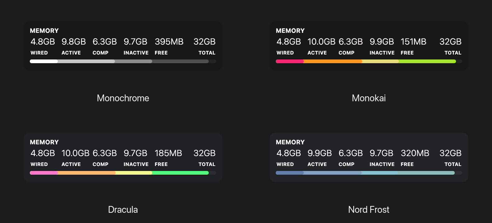
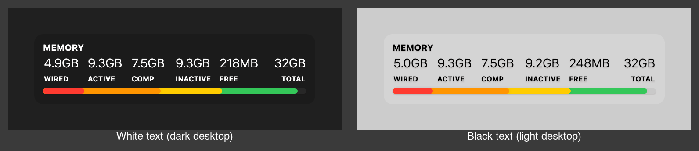

# Theme Controller

[](https://creativecommons.org/licenses/by-nc/4.0/)

An invisible controller widget for [Übersicht](http://tracesof.net/uebersicht/) that themes a whole set of companion widgets from one place. It renders nothing on screen. Its only job is to publish a set of CSS custom properties (color, contrast, panel tint, status and series colors) onto the page root, where the other widgets pick them up.

## What it looks like

The controller renders nothing itself. The images below show the effect on the two axes.

**Scheme** — the same companion widget (Memory) under four of the bundled schemes:



Eleven ship with the widget: Monochrome, macOS, Apple Classic, iOS, Monokai, Monokai Pro, Dracula, Solarized, Nord Frost, Nord Aurora and Tokyo Night.

**Mode** — the controller flips every widget's ink between white and black to match your desktop, so it stays legible over any wallpaper (a dark desktop gets white text, a light desktop gets black text) while the accent colors stay put:



## How it works

The theme is defined by two axes:

- **Mode (light / dark)** decides the two poles: the ink (content) color and the panel-tint base. Mode is chosen from `modeSource`:
  - `'wallpaper'` (default) matches your menu-bar tint. The widget runs `screencapture` on the menu-bar strip and a small Swift helper (`lib/menubar-darkness.swift`) averages its brightness; a dark wallpaper (white menu-bar text) maps to the widget's light-ink theme, and vice-versa. This is the same signal macOS uses to color the menu bar, so the widgets track the desktop instead of the system appearance setting.
  - `'light'` or `'dark'` forces a mode outright.
- **Scheme** decides the color palette and accents layered on top of the mode's neutrals.

On each refresh the widget resolves the two axes and writes the tokens to `document.documentElement` with `root.style.setProperty(...)`. Every companion widget reads them as `var(--token, <fallback>)`, so:

- With this controller installed, all the widgets share one coordinated look and flip together with the wallpaper.
- Without it, each widget falls back to its own built-in defaults and still works standalone. **This controller is optional; it enhances the set, it is not required by any single widget.**

Tokens published include `--text`, `--panel-bg`, `--panel-blur`, `--level-max/hi/mid/lo/base`, `--secondary`, `--hairline`, `--dot-grid`, `--area-fill-*`, the status ramp (`--status-ok/warn/elevated/critical` and their `-fill` variants), the series colors (`--series-primary…quaternary` and `-fill`), palette accents (e.g. `--ios-pink`, `--apple-blue`), and `--loved`.

## Companion widgets

These widgets consume the tokens and are themed by this controller (each also works on its own):

- [uebersicht-cpu-usage](https://github.com/dionmunk/uebersicht-cpu-usage)
- [uebersicht-memory-usage](https://github.com/dionmunk/uebersicht-memory-usage)
- [uebersicht-storage-usage](https://github.com/dionmunk/uebersicht-storage-usage)
- [uebersicht-network-throughput](https://github.com/dionmunk/uebersicht-network-throughput)
- [uebersicht-top-processes](https://github.com/dionmunk/uebersicht-top-processes)
- [uebersicht-top-memory](https://github.com/dionmunk/uebersicht-top-memory)
- [uebersicht-top-battery](https://github.com/dionmunk/uebersicht-top-battery)
- [uebersicht-internal-battery-status](https://github.com/dionmunk/uebersicht-internal-battery-status)
- [uebersicht-bluetooth-battery-status](https://github.com/dionmunk/uebersicht-bluetooth-battery-status)
- [uebersicht-weather](https://github.com/dionmunk/uebersicht-weather)
- [uebersicht-news](https://github.com/dionmunk/uebersicht-news)
- [uebersicht-stocks](https://github.com/dionmunk/uebersicht-stocks)
- [uebersicht-github-contributions](https://github.com/dionmunk/uebersicht-github-contributions)
- [uebersicht-music](https://github.com/dionmunk/uebersicht-music)
- [uebersicht-visualizer](https://github.com/dionmunk/uebersicht-visualizer)
- [uebersicht-layout-controller](https://github.com/dionmunk/uebersicht-layout-controller)

## Themes

Each scheme lives in its own plain YAML file under `themes/`. They are kept as **data** (not code) on purpose: Übersicht treats every `.js`/`.jsx`/`.coffee` file in a widget folder as its own widget, so code-based theme files would clutter the widget list. YAML is ignored by that scan, and unlike JSON it can carry comments and attribution.

```
theme-controller.widget/
├── index.coffee           # config, mode/neutral logic, applies tokens to :root
└── themes/
    ├── _example.yaml      # annotated template to copy
    ├── monochrome.yaml
    ├── macos.yaml
    ├── apple-classic.yaml
    ├── ios.yaml
    ├── monokai.yaml
    ├── monokai-pro.yaml
    ├── dracula.yaml
    ├── solarized.yaml
    ├── nord-frost.yaml
    ├── nord-aurora.yaml
    └── tokyo-night.yaml
```

**A theme is just a short list of named colors.** You do not write tokens, `rgba()` or role
wiring; the widget derives all of that. In practice a theme is about seven lines:

```yaml
red:    "#F92672"
orange: "#FD971F"
yellow: "#E6DB74"
green:  "#A6E22E"
blue:   "#66D9EF"
purple: "#AE81FF"
pink:   "#F92672"
```

From those the widget publishes each color plus its RGB channel triplet (`--red` and
`--red-ch`), then maps the shared role contract onto them: the status ramp
(`--status-ok` / `-warn` / `-elevated` / `-critical` from green / yellow / orange / red),
the four data series (`--series-primary` through `--series-quaternary` from red / orange /
yellow / green), and the matching translucent `-fill` variants. Because every scheme maps
the same roles the same way, switching scheme reskins every companion widget with no edits
anywhere else.

Two optional keys go further. `background` tints the translucent panels with the theme's own
background color instead of the neutral tint, and `background-opacity` (0–1, default `.3`)
sets how solid that is. `primary` and `secondary` name which colors act as the accent pair.

Monochrome is the one exception: it has no hues at all. It ships as an empty palette, which
makes the widget fall back to ink-only roles, so every token is the current mode's ink at a
stepped opacity and the whole scheme flips for free when the mode does.

At startup the widget fetches the active scheme's file, mapping its name to a slug by
lowercasing and replacing spaces with hyphens (`iOS` → `themes/ios.yaml`, `Apple Classic` →
`themes/apple-classic.yaml`), and merges it over the mode-driven neutrals. To add a scheme,
copy `_example.yaml`, pick your colors, and set `scheme` to its name.

## Options

At the top of `index.coffee`:

```coffeescript
  # Which scheme's palette + accents to apply.
  scheme: 'Monokai'      # 'monochrome' | 'macOS' | 'Apple Classic' | 'iOS' | 'Monokai'
                         # | 'Monokai Pro' | 'Dracula' | 'Solarized' | 'Nord Frost'
                         # | 'Nord Aurora' | 'Tokyo Night'

  # How light/dark mode is chosen.
  modeSource: 'wallpaper'   # 'wallpaper' (match the menu-bar tint) | 'light' | 'dark'

  # Wallpaper darkness (0=white .. 100=black) at/above which the wallpaper is
  # treated as dark. Only used when modeSource is 'wallpaper'.
  darknessThreshold: 32
```

## Requirements

- **Screen Recording permission** (only when `modeSource: 'wallpaper'`). The widget captures the menu-bar strip with `screencapture` to read its brightness. Grant the Übersicht app access under **System Settings > Privacy & Security > Screen Recording**, then restart Übersicht. If you'd rather not grant it, set `modeSource` to `'light'` or `'dark'` and no screen capture happens.
- **Xcode Command Line Tools.** The brightness helper is built from `lib/menubar-darkness.swift` with `swiftc` on first run. Install with `xcode-select --install`. The compiled binary is generated locally and is not committed.

No other privacy permissions are needed.

## Installation

- Download the [repository](https://github.com/dionmunk/uebersicht-theme-controller/archive/master.zip) and extract it.
- Place the `theme-controller.widget` folder in your Übersicht extension folder.
- Grant Screen Recording permission (or set `modeSource` to `'light'`/`'dark'`).
- Refresh Übersicht.

## License

This work is licensed under a [Creative Commons Attribution-NonCommercial 4.0 International License](https://creativecommons.org/licenses/by-nc/4.0/).
